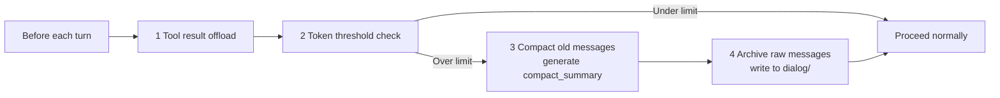
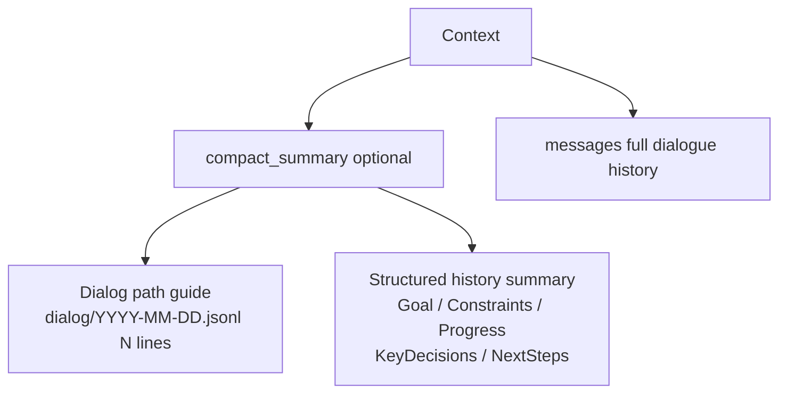
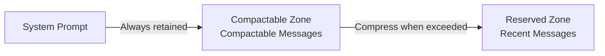
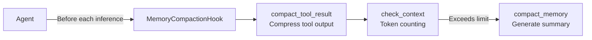
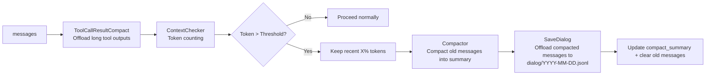
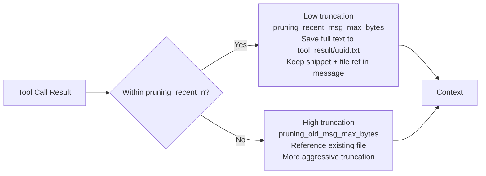
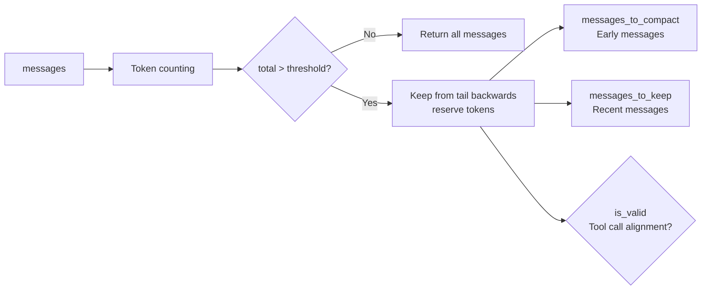
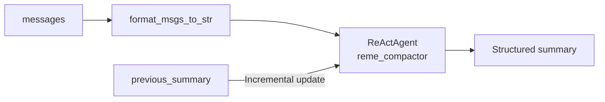
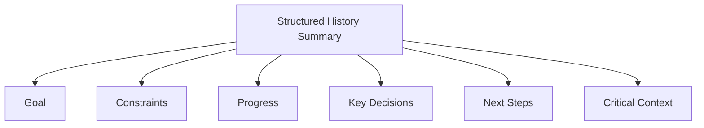

# Context Management

## Overview

Imagine the LLM's context window as a **backpack with limited capacity** 🎒. Every conversation turn, every tool call result adds something to the backpack. As the conversation goes on, the backpack gets fuller and fuller...

**Context management** is a set of mechanisms that help you "manage your backpack", ensuring the AI can work continuously and efficiently.

> The context management mechanism is inspired by [OpenClaw](https://github.com/openclaw/openclaw) and independently implemented via **LightContextManager** in QwenPaw.

### How It Works — Summary

QwenPaw context management uses two parallel offload paths to handle the limited context window:

| Mechanism                          | Triggered When                        | Offload Target            | What Stays in Context                    |
| ---------------------------------- | ------------------------------------- | ------------------------- | ---------------------------------------- |
| **Tool result offload**            | Tool output exceeds byte threshold    | `tool_result/{uuid}.txt`  | Snippet + file path reference            |
| **Conversation compact + archive** | Context token count exceeds threshold | `dialog/YYYY-MM-DD.jsonl` | `compact_summary` (summary + path guide) |

**Before each inference turn**, `MemoryCompactionHook` runs in order:



- **No data loss**: Compacted raw conversations are saved in `dialog/`, tool outputs in `tool_result/` — the Agent can always retrieve them via `read_file`
- **Context continuity**: `compact_summary` retains a structured summary + dialog path guide so the Agent never loses context
- **Automatic**: Triggers without manual intervention; `/compact` can also trigger it manually

## Context Structure

### In-Memory Data Structure

QwenPaw's context consists of two components:



| Component                    | Description                                                                |
| ---------------------------- | -------------------------------------------------------------------------- |
| **compact_summary**          | Generated after compaction; contains two parts (see below)                 |
| ↳ Dialog path guide          | Points to raw conversation data in `dialog/YYYY-MM-DD.jsonl` for reference |
| ↳ Structured history summary | Goal / Constraints / Progress / KeyDecisions / NextSteps                   |
| **messages**                 | Current conversation context (full message list)                           |

### File System Cache

Data evicted from the context is offloaded to the file system, keeping it traceable:

| Path                      | Contents                                                       |
| ------------------------- | -------------------------------------------------------------- |
| `dialog/YYYY-MM-DD.jsonl` | Compacted raw conversation messages, appended chronologically  |
| `tool_result/{uuid}.txt`  | Full text of long tool call results; auto-cleaned after N days |

### Message Zone Division



| Zone                 | Description                                      | Handling                                                      |
| -------------------- | ------------------------------------------------ | ------------------------------------------------------------- |
| **System Prompt**    | The AI's "role definition" and base instructions | Always retained, never compacted                              |
| **Compactable Zone** | Historical conversation messages                 | Token counted; compacted into summary when threshold exceeded |
| **Reserved Zone**    | Most recent N messages                           | Kept as-is, ensuring context continuity                       |

### Structure Example

```
┌─────────────────────────────────────────┐
│ System Prompt (Fixed)                    │  ← Always retained
│ "You are an AI assistant..."             │
├─────────────────────────────────────────┤
│ compact_summary (Optional)               │  ← Generated after compaction
│  - [Dialog guide] dialog/2025-01-15.jsonl│
│  - Goal: Build user login system         │
│  - Progress: Login API completed...      │
├─────────────────────────────────────────┤
│ Compactable Zone                         │  ← Compacted when exceeded
│ [Message 1] User: Help me build login    │
│ [Message 2] Assistant: Sure, I'll...     │
│ [Message 3] Tool call result...          │
│ ...                                      │
├─────────────────────────────────────────┤
│ Reserved Zone                            │  ← Always retained
│ [Message N-2] User: Add registration     │
│ [Message N-1] Assistant: Sure...         │
│ [Message N] User: Done!                  │
└─────────────────────────────────────────┘
```

## Management Mechanism

### Architecture Overview



### Related Code

- [LightContextManager](https://github.com/agentscope-ai/QwenPaw/blob/main/src/qwenpaw/agents/context/light_context_manager.py)
- [AsMsgHandler](https://github.com/agentscope-ai/QwenPaw/blob/main/src/qwenpaw/agents/context/as_msg_handler.py) — Context checking and message formatting
- [compactor_prompts](https://github.com/agentscope-ai/QwenPaw/blob/main/src/qwenpaw/agents/context/compactor_prompts.py) — Compaction prompts

### Execution Flow



**Execution Order**:

1. `ToolCallResultCompact` — Offload long tool outputs to `tool_result/` (if enabled)
2. `ContextChecker` — Determine if token count exceeds threshold
3. `Compactor` — Compress old messages into a structured summary (`compact_memory`)
4. `SaveDialog` — Persist the compacted raw messages to `dialog/YYYY-MM-DD.jsonl`

## Compaction Mechanism

When the context approaches its limit, QwenPaw automatically triggers compaction, condensing old conversations into a structured summary.

### 1. compact_tool_result — Tool Result Compaction

When `tool_result_pruning_config.enabled` is on (default `true`), different byte thresholds are applied based on how recent a message is:



| Message type                   | Threshold                      | Default | Behavior                                        |
| ------------------------------ | ------------------------------ | ------- | ----------------------------------------------- |
| Most recent `pruning_recent_n` | `pruning_recent_msg_max_bytes` | `50000` | Preserve more content; save full text to file   |
| Older messages                 | `pruning_old_msg_max_bytes`    | `3000`  | Aggressive truncation; reuse existing file path |

**Tool-specific behavior:**

- **Browser-use type tools**: On first call, full content is saved to `tool_result/uuid.txt`, message keeps snippet + file reference with a "read from line N" hint; secondary truncation applies once the message falls outside `pruning_recent_n`
- **read_file tool**: No truncation or file save within `pruning_recent_n` (content is already an external file); beyond `pruning_recent_n`, truncated and saved to `tool_result/`
- Files older than `offload_retention_days` are automatically cleaned up

### 2. check_context — Context Check

Determines if context exceeds limits based on token counting, automatically splitting messages into "to compact" and "to keep" groups.



- **Core Logic**: Reserve `memory_compact_reserve` tokens from the tail backwards, marking excess as to-be-compacted
- **Integrity Guarantee**: Does not split user-assistant conversation pairs or tool_use/tool_result pairs

### 3. compact_memory — Conversation Compaction

Uses ReActAgent to compress historical conversations into a **structured context summary**:



### 4. Manual Compaction (/compact Command)

Proactively trigger compaction:

```
/compact
```

You can also add an optional instruction for this manual run:

```
/compact keep requirements and decisions only
```

After execution, you'll see:

```
**Compact Complete!**

- Messages compacted: 12
**Compressed Summary:**
<compacted summary content>
```

Response breakdown:

- 📊 **Messages compacted** - How many messages were compacted
- 📝 **Compressed Summary** - The generated summary content

## Compaction Summary Structure

`compact_summary` consists of two parts: a **dialog path guide** and a **structured history summary**.

### Dialog Path Guide

Points to compacted raw conversation data in `dialog/YYYY-MM-DD.jsonl` (written chronologically; recommended to read from the end backwards). The Agent can use the `read_file` tool to review historical details without keeping raw messages in the active context.

### Structured History Summary



| Field                | Content                                 | Example                                        |
| -------------------- | --------------------------------------- | ---------------------------------------------- |
| **Goal**             | What the user wants to accomplish       | "Build a user login system"                    |
| **Constraints**      | Requirements and preferences            | "Use TypeScript, no frameworks"                |
| **Progress**         | Completed / in-progress / blocked tasks | "Login API done, registration API in progress" |
| **Key Decisions**    | Decisions made and their rationale      | "Chose JWT over Sessions for statelessness"    |
| **Next Steps**       | What to do next                         | "Implement password reset feature"             |
| **Critical Context** | Data needed to continue work            | "Main file is at src/auth.ts"                  |

- **Incremental Update**: When `previous_summary` is provided, new conversations are automatically merged with the old summary
- **Information Preservation**: Compaction preserves exact file paths, function names, and error messages, ensuring seamless context transitions

## Configuration

Configuration is located in `~/.qwenpaw/workspaces/{agent_id}/agent.json` under `agents.running`:

**`running` top-level fields:**

| Parameter                 | Default       | Description                        |
| ------------------------- | ------------- | ---------------------------------- |
| `max_input_length`        | `131072`      | Model context window size (tokens) |
| `context_manager_backend` | `"light"`     | Context manager backend type       |
| `memory_manager_backend`  | `"remelight"` | Memory manager backend type        |

**`running.light_context_config` fields:**

| Parameter                      | Default    | Description                                            |
| ------------------------------ | ---------- | ------------------------------------------------------ |
| `dialog_path`                  | `"dialog"` | Dialog persistence directory (relative to working dir) |
| `token_count_estimate_divisor` | `4.0`      | Divisor for byte-based token estimation                |

**`running.light_context_config.context_compact_config` fields:**

| Parameter                     | Default | Description                                                                                    |
| ----------------------------- | ------- | ---------------------------------------------------------------------------------------------- |
| `enabled`                     | `true`  | Whether to enable automatic context compaction                                                 |
| `compact_threshold_ratio`     | `0.8`   | Threshold ratio for triggering compaction, triggers when `max_input_length × ratio` is reached |
| `reserve_threshold_ratio`     | `0.1`   | Ratio of recent messages to keep during compaction, keeps `max_input_length × ratio` tokens    |
| `compact_with_thinking_block` | `true`  | Whether to include thinking blocks during compaction                                           |

**`running.light_context_config.tool_result_pruning_config` fields:**

| Parameter                      | Default | Description                                                                |
| ------------------------------ | ------- | -------------------------------------------------------------------------- |
| `enabled`                      | `true`  | Whether to prune long tool outputs                                         |
| `pruning_recent_n`             | `2`     | Number of recent messages to use higher threshold for                      |
| `pruning_old_msg_max_bytes`    | `3000`  | Byte threshold for older tool result messages                              |
| `pruning_recent_msg_max_bytes` | `50000` | Byte threshold for the most recent `pruning_recent_n` tool result messages |
| `offload_retention_days`       | `5`     | Days to retain cached tool output files (auto-cleaned after expiry)        |

**Calculation Relationships:**

- `memory_compact_threshold` = `max_input_length × compact_threshold_ratio` (threshold for triggering compaction)
- `memory_compact_reserve` = `max_input_length × reserve_threshold_ratio` (tokens of recent messages to keep)

**Example Configuration:**

```json
{
  "agents": {
    "running": {
      "max_input_length": 128000,
      "context_manager_backend": "light",
      "light_context_config": {
        "dialog_path": "dialog",
        "context_compact_config": {
          "enabled": true,
          "compact_threshold_ratio": 0.8,
          "reserve_threshold_ratio": 0.1
        },
        "tool_result_pruning_config": {
          "enabled": true,
          "pruning_recent_n": 2,
          "pruning_old_msg_max_bytes": 3000,
          "pruning_recent_msg_max_bytes": 50000
        }
      }
    }
  }
}
```
