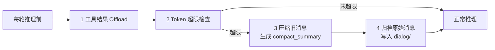
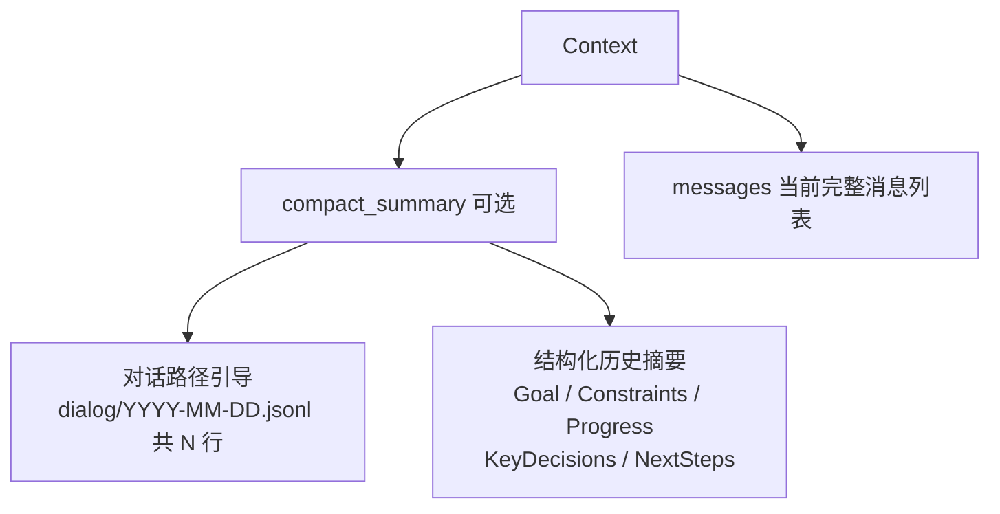
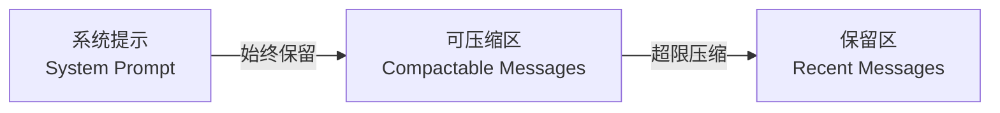
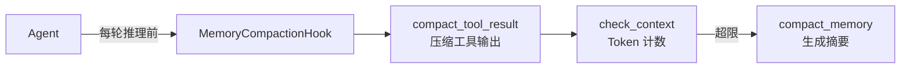
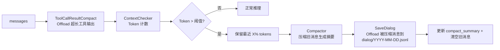
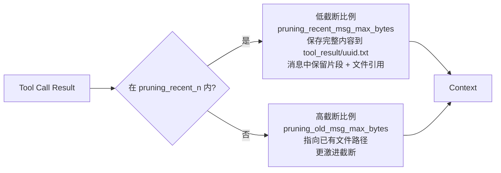
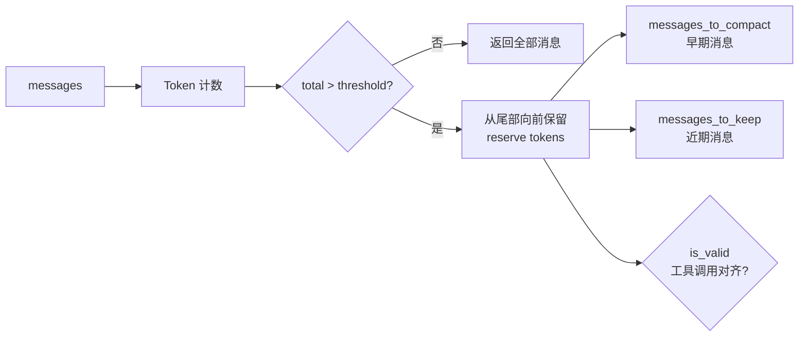
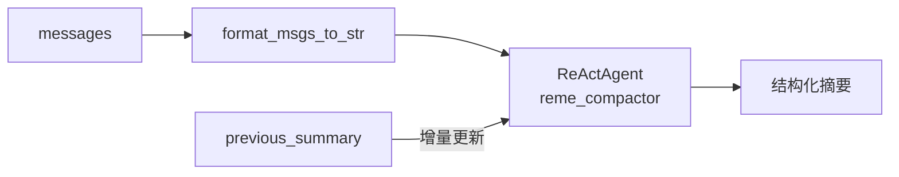
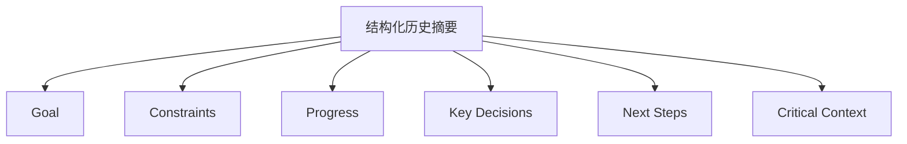

# 上下文管理（Context Management）

## 概述

LLM 的上下文窗口就像一个**有限容量的背包** 🎒。每次对话、每个工具调用的结果都会往背包里放东西。随着对话进行，背包越来越满...

**上下文管理**就是一套帮你"管理背包"的机制，确保 AI 能够持续、高效地工作。

> 上下文管理机制设计受 [OpenClaw](https://github.com/openclaw/openclaw) 启发，由 QwenPaw 的 **LightContextManager** 独立实现。

### 工作原理 — 总结

QwenPaw 上下文管理分为两条并行的 Offload 路径，共同解决上下文窗口有限的问题：

| 机制                 | 触发时机              | Offload 目标              | 保留在上下文的内容                   |
| -------------------- | --------------------- | ------------------------- | ------------------------------------ |
| **工具结果 Offload** | 工具输出字节超出阈值  | `tool_result/{uuid}.txt`  | 片段 + 文件路径引用                  |
| **对话压缩 + 归档**  | 上下文 Token 超出阈值 | `dialog/YYYY-MM-DD.jsonl` | `compact_summary`（摘要 + 路径引导） |

**每轮推理前**，`MemoryCompactionHook` 按顺序执行：



- **不丢失信息**：被压缩的原始对话保存在 `dialog/`，工具输出保存在 `tool_result/`，Agent 随时可通过 `read_file` 工具回溯
- **保持连贯**：`compact_summary` 保留结构化摘要 + 对话路径引导，确保 Agent 不失去上下文
- **自动触发**：无需手动干预，也可用 `/compact` 主动触发

## 上下文结构

### 内存中的数据结构

QwenPaw 的上下文由两部分组成：



| 组件                | 说明                                                     |
| ------------------- | -------------------------------------------------------- |
| **compact_summary** | 压缩后生成，包含两部分（见下方）                         |
| ↳ 对话路径引导      | 指向 `dialog/YYYY-MM-DD.jsonl` 中原始对话数据的读取引导  |
| ↳ 结构化历史摘要    | Goal / Constraints / Progress / KeyDecisions / NextSteps |
| **messages**        | 当前对话上下文（完整消息列表）                           |

### 文件系统缓存

超出上下文的数据会 Offload 到文件系统，保持可追溯性：

| 路径                      | 内容                                      |
| ------------------------- | ----------------------------------------- |
| `dialog/YYYY-MM-DD.jsonl` | 被压缩的原始对话消息，按时间顺序追加写入  |
| `tool_result/{uuid}.txt`  | 超长工具调用结果原文，保留 N 天后自动清理 |

### 消息区域划分



| 区域         | 说明                      | 处理方式                     |
| ------------ | ------------------------- | ---------------------------- |
| **系统提示** | AI 的"角色设定"和基础指令 | 始终保留，永不压缩           |
| **可压缩区** | 历史对话消息              | Token 计数，超限时压缩为摘要 |
| **保留区**   | 最近 N 条消息             | 保持原样，确保上下文连贯     |

### 结构示例

```
┌─────────────────────────────────────────┐
│ System Prompt (固定)                     │  ← 始终保留
│ "你是一个 AI 助手..."                     │
├─────────────────────────────────────────┤
│ compact_summary (可选)                   │  ← 压缩后生成
│  - [对话路径引导] dialog/2025-01-15.jsonl│
│  - Goal: 构建用户登录系统                 │
│  - Progress: 登录接口已完成...            │
├─────────────────────────────────────────┤
│ 可压缩区                                 │  ← 超限时会被压缩
│ [消息1] 用户: 帮我写个登录功能             │
│ [消息2] 助手: 好的，我来实现...            │
│ [消息3] 工具调用结果...                   │
│ ...                                      │
├─────────────────────────────────────────┤
│ 保留区                                   │  ← 始终保留
│ [消息N-2] 用户: 再加个注册功能             │
│ [消息N-1] 助手: 好的...                   │
│ [消息N] 用户: 完成！                      │
└─────────────────────────────────────────┘
```

## 管理机制

### 架构概览



### 相关代码

- [LightContextManager](https://github.com/agentscope-ai/QwenPaw/blob/main/src/qwenpaw/agents/context/light_context_manager.py)
- [AsMsgHandler](https://github.com/agentscope-ai/QwenPaw/blob/main/src/qwenpaw/agents/context/as_msg_handler.py) — 上下文检查与消息格式化
- [compactor_prompts](https://github.com/agentscope-ai/QwenPaw/blob/main/src/qwenpaw/agents/context/compactor_prompts.py) — 压缩提示词

### 执行流程



**执行顺序**：

1. `ToolCallResultCompact` — 超长工具输出 Offload 到 `tool_result/`（如果启用）
2. `ContextChecker` — 基于 Token 计数判断是否超限
3. `Compactor` — 将旧消息压缩为结构化摘要（`compact_memory`）
4. `SaveDialog` — 将被压缩的原始消息持久化到 `dialog/YYYY-MM-DD.jsonl`

## 压缩机制

当上下文接近限制时，QwenPaw 会自动触发压缩，将旧对话浓缩为结构化摘要。

### 1. compact_tool_result — 工具结果压缩

当 `tool_result_pruning_config.enabled` 开启时（默认 `true`），对每条工具调用结果按新旧程度使用不同的字节阈值截断：



| 消息类型                   | 阈值                           | 默认值  | 说明                           |
| -------------------------- | ------------------------------ | ------- | ------------------------------ |
| 最近 `pruning_recent_n` 条 | `pruning_recent_msg_max_bytes` | `50000` | 保留较多内容，同时写入完整文件 |
| 更早的消息                 | `pruning_old_msg_max_bytes`    | `3000`  | 激进截断，已有文件路径继续引用 |

**特殊工具说明：**

- **Browser Use 类工具**：首次调用保存原始内容到 `tool_result/uuid.txt`，消息中保留片段 + 文件引用，并提示从第 N 行读取；超出 `pruning_recent_n` 后进行二次截断
- **read_file 工具**：`pruning_recent_n` 内不截断也不保存（内容已是外部文件）；超出后截断并保存到 `tool_result/`
- 超过 `offload_retention_days` 天的文件自动清理

### 2. check_context — 上下文检查

基于 Token 计数判断上下文是否超限，自动拆分为「待压缩」和「保留」两组消息。



- **核心逻辑**：从尾部向前保留 `memory_compact_reserve` tokens，超出部分标记为待压缩
- **完整性保证**：不拆分 user-assistant 对话对，不拆分 tool_use/tool_result 配对

### 3. compact_memory — 对话压缩

使用 ReActAgent 将历史对话压缩为**结构化上下文摘要**：



### 4. 手动压缩（/compact 命令）

主动触发压缩：

```
/compact
```

你也可以为这次手动压缩附加一条说明：

```
/compact 只保留需求和关键决策
```

执行后返回：

```
**Compact Complete!**

- Messages compacted: 12
**Compressed Summary:**
<压缩摘要内容>
```

返回内容说明：

- 📊 **Messages compacted** - 压缩了多少条消息
- 📝 **Compressed Summary** - 生成的摘要内容

## 压缩摘要结构

`compact_summary` 由两部分组成：**对话路径引导** + **结构化历史摘要**。

### 对话路径引导

指向 `dialog/YYYY-MM-DD.jsonl` 中被压缩的原始对话数据（按时间顺序写入，建议从后往前读）。Agent 可通过 `read_file` 工具回顾历史细节，而无需将原始消息保留在上下文中。

### 结构化历史摘要



| 字段                 | 内容                   | 举例                                    |
| -------------------- | ---------------------- | --------------------------------------- |
| **Goal**             | 用户目标               | "构建一个用户登录系统"                  |
| **Constraints**      | 约束和偏好             | "使用 TypeScript，不要用任何框架"       |
| **Progress**         | 完成/进行中/阻塞的任务 | "登录接口已完成，注册接口进行中"        |
| **Key Decisions**    | 关键决策及原因         | "选择 JWT 而非 Session，因为需要无状态" |
| **Next Steps**       | 接下来要做什么         | "实现密码重置功能"                      |
| **Critical Context** | 继续工作所需的数据     | "主文件在 src/auth.ts"                  |

- **增量更新**：传入 `previous_summary` 时，自动将新对话与旧摘要合并
- **信息保留**：压缩会保留确切的文件路径、函数名称和错误消息，确保上下文无缝衔接

## 配置

配置文件位于 `~/.qwenpaw/workspaces/{agent_id}/agent.json` 中的 `running` 部分：

**`running` 直接字段：**

| 参数                      | 默认值        | 说明                         |
| ------------------------- | ------------- | ---------------------------- |
| `max_input_length`        | `131072`      | 模型上下文窗口大小（tokens） |
| `context_manager_backend` | `"light"`     | 上下文管理器后端类型         |
| `memory_manager_backend`  | `"remelight"` | 记忆管理器后端类型           |

**`running.light_context_config` 字段：**

| 参数                           | 默认值     | 说明                             |
| ------------------------------ | ---------- | -------------------------------- |
| `dialog_path`                  | `"dialog"` | 对话持久化目录（相对于工作目录） |
| `token_count_estimate_divisor` | `4.0`      | 基于字节的 token 估算除数        |

**`running.light_context_config.context_compact_config` 字段：**

| 参数                          | 默认值 | 说明                                                             |
| ----------------------------- | ------ | ---------------------------------------------------------------- |
| `enabled`                     | `true` | 是否启用自动上下文压缩                                           |
| `compact_threshold_ratio`     | `0.8`  | 触发压缩的阈值比例，达到 `max_input_length * ratio` 时压缩       |
| `reserve_threshold_ratio`     | `0.1`  | 压缩时保留的最近消息比例，保留 `max_input_length * ratio` tokens |
| `compact_with_thinking_block` | `true` | 压缩时是否包含 thinking block                                    |

**`running.light_context_config.tool_result_pruning_config` 字段：**

| 参数                           | 默认值  | 说明                                             |
| ------------------------------ | ------- | ------------------------------------------------ |
| `enabled`                      | `true`  | 是否修剪超长工具输出                             |
| `pruning_recent_n`             | `2`     | 最近 N 条消息使用较高阈值                        |
| `pruning_old_msg_max_bytes`    | `3000`  | 旧消息的工具输出字节阈值                         |
| `pruning_recent_msg_max_bytes` | `50000` | 最近 `pruning_recent_n` 条消息的工具输出字节阈值 |
| `offload_retention_days`       | `5`     | 工具输出缓存文件的保留天数（超期自动清理）       |

**计算关系：**

- `memory_compact_threshold` = `max_input_length × compact_threshold_ratio`（触发压缩的阈值）
- `memory_compact_reserve` = `max_input_length × reserve_threshold_ratio`（保留的最近消息 tokens）

**示例配置：**

```json
{
  "agents": {
    "running": {
      "max_input_length": 128000,
      "context_manager_backend": "light",
      "light_context_config": {
        "dialog_path": "dialog",
        "context_compact_config": {
          "enabled": true,
          "compact_threshold_ratio": 0.8,
          "reserve_threshold_ratio": 0.1
        },
        "tool_result_pruning_config": {
          "enabled": true,
          "pruning_recent_n": 2,
          "pruning_old_msg_max_bytes": 3000,
          "pruning_recent_msg_max_bytes": 50000
        }
      }
    }
  }
}
```
