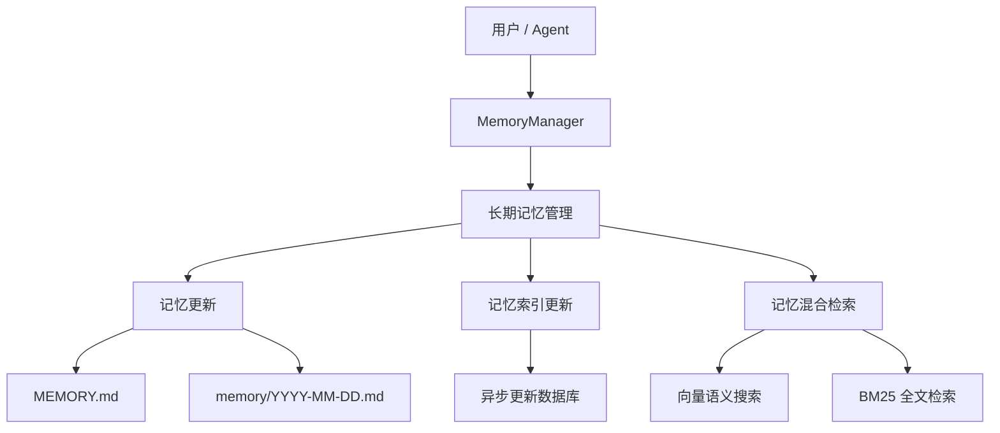
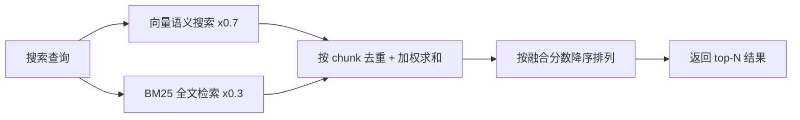

# 长期记忆

**长期记忆** 让 QwenPaw 拥有跨对话的持久记忆能力：通过文件工具将关键信息写入 Markdown 文件长期保存，并配合语义检索随时召回。

> 长期记忆机制设计受 [OpenClaw](https://github.com/openclaw/openclaw) 启发，由 [ReMe](https://github.com/agentscope-ai/ReMe) 的 **ReMeLight** 实现——以文件系统为存储后端，记忆即 Markdown 文件，可直接读取、编辑与迁移。

---

## 架构概览



长期记忆管理包含以下能力：

| 能力           | 说明                                                                                    |
| -------------- | --------------------------------------------------------------------------------------- |
| **记忆持久化** | 通过文件工具（`read` / `write` / `edit`）将关键信息写入 Markdown 文件，文件即真实数据源 |
| **文件监控**   | 通过 `watchfile` 监控文件改动，异步更新本地数据库（语义索引 & 向量索引）                |
| **语义搜索**   | 通过向量嵌入 + BM25 混合检索，按语义召回相关记忆                                        |
| **文件读取**   | 直接通过文件工具读取对应的 Memory Markdown 文件，按需加载保持上下文精简                 |
| **梦境优化**   | 定时自动整理和优化 MEMORY.md，去冗存精，保持记忆库的高质量                              |

---

## 记忆文件结构

记忆采用纯 Markdown 文件存储，Agent 通过文件工具直接操作。默认工作空间使用以下层次结构：

```
{工作区}/
├── MEMORY.md              ← Auto-Dream优化的长期记忆（结晶化）
│   包含：核心决策、用户偏好、可复用经验
│
├── memory/                ← Auto-Memory写入的每日记忆（原始记录）
│   ├── 2026-04-20.md
│   ├── 2026-04-21.md      ← Auto-Dream读取当日日志
│   └── ...
│
└── backup/                ← Auto-Dream创建的备份
    ├── memory_backup_20260421_230000.md
    └── ...                ← 可用于恢复历史版本
```

### MEMORY.md（长期记忆，可选）

存放长期有效、极少变动的关键信息。

- **位置**：`{working_dir}/MEMORY.md`
- **用途**：存储决策、偏好、持久性事实、经验教训
- **更新**：Agent 通过 `write` / `edit` 文件工具写入，或通过 **Auto-Dream** 自动优化

### memory/YYYY-MM-DD.md（每日日志）

每天一页，追加写入，记录当天的工作与交互。

- **位置**：`{working_dir}/memory/YYYY-MM-DD.md`
- **用途**：记录日常笔记和运行上下文
- **更新**：Agent 通过 `write` / `edit` 文件工具追加写入，对话过长需要进行总结时自动触发
- **角色**：作为 **Auto-Dream** 优化的输入源

### backup/（备份目录）

存储 Auto-Dream 优化前的 MEMORY.md 备份文件。

- **位置**：`{working_dir}/backup/`
- **用途**：每次 Auto-Dream 执行前自动创建备份，可用于恢复历史版本
- **命名格式**：`memory_backup_YYYYMMDD_HHMMSS.md`

---

## 记忆管理流程

记忆管理系统遵循三阶段自动化工作流，不同类型的记忆信息在相应阶段自动写入：

| 信息类型                         | 写入目标               | 写入时机             | 处理方式                                                                                        |
| -------------------------------- | ---------------------- | -------------------- | ----------------------------------------------------------------------------------------------- |
| 日常笔记、运行上下文             | `memory/YYYY-MM-DD.md` | **积累阶段（白天）** | Auto-Memory 自动追加写入当日日志                                                                |
| 决策、偏好、持久事实、可复用经验 | `MEMORY.md`            | **整合阶段（晚上）** | Auto-Dream 应用五大原则结晶化后写入，严格限定为：核心业务决策、确认的用户偏好、高价值可复用经验 |
| 用户说"记住这个"                 | `memory/YYYY-MM-DD.md` | **积累阶段（白天）** | 立即写入当日日志，后续由 Auto-Dream 处理                                                        |

推荐组合：白天开启 Auto-Memory 积累记忆 → 晚上 Auto-Dream 整合优化 → 次日 Auto-Memory-Search 精准检索。

### 积累阶段 - Auto-Memory

Auto-Memory 是自动记忆总结能力，会在特定时机自动将对话中的重要信息持久化保存到记忆文件中，帮助智能体在多轮对话中积累知识和经验。

**记忆内容分类**

- **持久化记忆**：客观事实、用户偏好、项目状态、重要事件
- **经验反思**：可复用的思考逻辑、成功策略、应避免的陷阱，实现智能体自进化

**触发方式**

| 触发方式   | 配置项                   | 说明                                                | 默认值 |
| ---------- | ------------------------ | --------------------------------------------------- | ------ |
| 周期性触发 | `auto_memory_interval`   | 每 N 条用户消息后自动总结。设为 `null` 或留空则禁用 | `null` |
| 压缩时触发 | `summarize_when_compact` | 上下文超阈值压缩前先执行记忆总结                    | `true` |

- **输入**：用户对话、Agent 工具调用结果、用户明确的"记住这个"指令
- **输出**：按日期组织的原始日志文件 `memory/YYYY-MM-DD.md`，同一天多次总结会智能合并，避免重复
- **特点**：保留所有细节，不做筛选或优化

### 整合阶段 - Auto-Dream

Auto-Dream 是智能记忆整合系统，在安静时段自动优化 MEMORY.md。可以把它想象成 AI 助手在"做梦"，思考什么才是真正值得记住的。

- **触发时间**：默认每晚 11 点（Cron 表达式 `"0 23 * * *"`），可通过 Cron 表达式修改或取消
- **输入源**：从 `memory/` 目录读取当日及历史日志
- **手动触发**：可通过 API 或命令手动执行 `dream()`

**五大优化原则**

| 原则         | 说明                                                |
| ------------ | --------------------------------------------------- |
| **去除噪音** | 删除临时细节、bug 修复记录和一次性任务              |
| **保留精华** | 只保留核心业务决策、已确认的用户偏好和可复用的洞察  |
| **解决矛盾** | 自动用最新状态更新过时信息                          |
| **创建结构** | 将零散笔记组织成连贯、通用的原则                    |
| **备份保护** | 每次优化前自动备份到 `backup/` 目录，可回溯历史版本 |

- **输出结果**：生成高质量结晶化知识更新至 `MEMORY.md`
- **内容规范**：严格限定为三类高价值信息：核心业务决策、确认的用户偏好、高价值可复用经验

### 检索阶段 - Auto-Memory-Search

Auto-Memory-Search 是自动记忆检索能力，在每轮对话开始前自动检索相关记忆并注入上下文，帮助智能体想起之前积累的知识和经验。

**核心机制**

- **触发时机**：每轮用户消息发送后、Agent 推理前自动执行
- **检索来源**：`MEMORY.md` + `memory/*.md`（所有记忆文件）
- **注入方式**：检索结果作为"已完成的工具调用"注入到消息历史中
- **与传统 RAG 的区别**：保持 KVCache 的完整性，提高 token 使用效率

**检索流程**

```
用户发送消息 → pre_reply 钩子
    ↓
提取最新消息文本作为查询 query（最多 100 字符）
    ↓
调用 memory_search(query, max_results, min_score)
    ↓
构建工具调用消息注入历史：
    [用户消息] + [助手: Searching memory...] + [系统: 检索结果]
    ↓
Agent 基于包含记忆结果的上下文进行推理
```

**使用效果**

开启 Auto-Memory-Search 后，智能体能够：

- **自动想起用户偏好**：用户说"帮我写代码" → 自动检索到"用户偏好中文交流"
- **复用历史决策**：用户问"认证模块怎么做" → 自动检索到之前的方案记录
- **避免重复错误**：智能体根据记忆中的"应避免跳过测试"自动规避

实际效果上，未开启时可能需要 16 个 step 才找到结果，开启后基于历史经验仅需 4 个 step。

---

## 搜索记忆

Agent 有两种方式找回过去的记忆：

| 方式     | 工具            | 适用场景                           | 示例                        |
| -------- | --------------- | ---------------------------------- | --------------------------- |
| 语义搜索 | `memory_search` | 不确定记在哪个文件，按意图模糊召回 | "之前关于部署流程的讨论"    |
| 直接读取 | `read_file`     | 已知具体日期或文件路径，精确查阅   | 读取 `memory/2025-02-13.md` |

### 混合检索原理

记忆搜索默认采用**向量 + BM25 混合检索**，两种检索方式各有所长，互为补充。

#### 向量语义搜索

将文本映射到高维向量空间，通过余弦相似度衡量语义距离，能捕捉意义相近但措辞不同的内容：

| 查询                   | 能召回的记忆                       | 为什么能命中                     |
| ---------------------- | ---------------------------------- | -------------------------------- |
| "项目的数据库选型"     | "最终决定用 PostgreSQL 替换 MySQL" | 语义相关：都在讨论数据库技术选择 |
| "怎么减少不必要的重建" | "配置了增量编译避免全量构建"       | 语义等价：减少重建 ≈ 增量编译    |
| "上次讨论的性能问题"   | "P99 延迟从 800ms 优化到 200ms"    | 语义关联：性能问题 ≈ 延迟优化    |

但向量搜索对**精确、高信号的 token** 表现较弱，因为嵌入模型倾向于捕捉整体语义而非单个 token 的精确匹配。

#### BM25 全文检索

基于词频统计进行子串匹配，对精确 token 命中效果极佳，但在语义理解（同义词、改写）方面较弱。

| 查询                       | BM25 能命中            | BM25 会漏掉                    |
| -------------------------- | ---------------------- | ------------------------------ |
| `handleWebSocketReconnect` | 包含该函数名的记忆片段 | "WebSocket 断线重连的处理逻辑" |
| `ECONNREFUSED`             | 包含该错误码的日志记录 | "数据库连接被拒绝"             |

**打分逻辑**：将查询拆分为词，统计每个词在目标文本中的命中比例，并为完整短语匹配提供加分：

```
base_score = 命中词数 / 查询总词数           # 范围 [0, 1]
phrase_bonus = 0.2（仅当多词查询且完整短语匹配时）
score = min(1.0, base_score + phrase_bonus)  # 上限 1.0
```

示例：查询 `"数据库 连接 超时"` 命中一段只包含 "数据库" 和 "超时" 的文本 → `base_score = 2/3 ≈ 0.67`，无完整短语匹配 → `score = 0.67`

> 为了处理 ChromaDB `$contains` 的大小写敏感问题，检索时会自动生成每个词的多种大小写变体（原文、小写、首字母大写、全大写），提高召回率。

#### 混合检索融合

同时使用向量和 BM25 两路召回信号，对结果进行**加权融合**（默认向量权重 `0.7`，BM25 权重 `0.3`）：

1. **扩大候选池**：将最终需要的结果数乘以 `candidate_multiplier`（默认 3 倍，上限 200），两路分别检索更多候选
2. **独立打分**：向量和 BM25 各自返回带分数的结果列表
3. **加权合并**：按 chunk 的唯一标识（`path + start_line + end_line`）去重融合
   - 仅被向量召回 → `final_score = vector_score × 0.7`
   - 仅被 BM25 召回 → `final_score = bm25_score × 0.3`
   - **两路都召回** → `final_score = vector_score × 0.7 + bm25_score × 0.3`
4. **排序截断**：按 `final_score` 降序排列，返回 top-N 结果

**示例**：查询 `"handleWebSocketReconnect 断线重连"`

| 记忆片段                                               | 向量分数 | BM25 分数 | 融合分数                       | 排序 |
| ------------------------------------------------------ | -------- | --------- | ------------------------------ | ---- |
| "handleWebSocketReconnect 函数负责 WebSocket 断线重连" | 0.85     | 1.0       | 0.85×0.7 + 1.0×0.3 = **0.895** | 1    |
| "网络断开后自动重试连接的逻辑"                         | 0.78     | 0.0       | 0.78×0.7 = **0.546**           | 2    |
| "修复了 handleWebSocketReconnect 的空指针异常"         | 0.40     | 0.5       | 0.40×0.7 + 0.5×0.3 = **0.430** | 3    |



> **总结**：单独使用任何一种检索方式都存在盲区。混合检索让两种信号互补，无论是「自然语言提问」还是「精确查找」，都能获得可靠的召回结果。

---

## 主动服务 - Proactive 模式

Proactive 是 QwenPaw 的主动服务能力，允许智能体在特定条件下主动向用户推送信息、建议或提醒，以辅助用户当前或潜在的任务。

### 功能定位

- 基于现有 memory（上下文管理 + 长期记忆）能力构建
- 支持以下典型场景：
  - 推送用户关心话题的最新进展（如"今日股市行情"）
  - 重试历史会话中未完成的用户需求
  - 为用户正在进行的工作补充信息（如相关学术主题的补充调研）
- 区别于 Claude Code Proactive：仅提供"信息/建议/提醒"，不直接执行高风险操作（如修改文件、发送网络请求等）

### 使用方式

- **默认不开启**（出于 token 消耗控制考虑）
- 启用方法：在任意会话中输入快捷命令 `/proactive`
  - 仅对当前 Agent 生效
  - 可配置 inactivity 超时时间（单位：分钟）
  - 启用成功后，系统返回提示消息
- 应用空闲指定时间后触发，Agent 在指定 session（ID 格式：`proactive_mode:{agent_id}`）中推送预测对用户有帮助的信息
  - 若该 session 不存在，则自动新建
  - 所有主动消息均以统一前缀标识：`[PROACTIVE]`
- 用户可随时通过命令 `/proactive off` 主动停用该模式

### 核心机制

整体结构：触发条件判断 → ReActAgent 执行 Proactive 信息回复

- 基于当前 Agent 的 workspace，新建一个专用的 Proactive ReActAgent 实例，专责"生成主动消息内容"的推理过程
- 出于稳定性考虑，暂未开放 Agent 完全自主决策，而是通过预设 workflow 实现 Beta 版本

Workflow 步骤：

1. **会话记忆内容聚合** — 提取近期对话、用户兴趣点、未完成任务等
2. **用户需求预测** — 基于上下文推测潜在需求，如"用户昨天问过某股票，今天可能想看更新"
3. **需求 Query 执行与返回** — 调用工具或检索最新信息，生成简洁、有价值的主动消息

### 防打扰策略

- 主动消息发送后，若用户持续无操作，系统**不会重复触发相同内容**
- 避免因频繁推送导致无效 token 消耗

---

## 备份恢复

Backup & Restore 是 QwenPaw 的备份恢复能力，可在版本升级、跨设备迁移、误操作回退等场景下，安全地保存并还原整个智能体环境。入口：控制台 → 设置 → 备份。

### 创建备份

**备份存储**

所有备份以独立 zip 包形式保存在用户目录下的 `~/.qwenpaw/backups`（与工作目录 `~/.qwenpaw` 同级）。每个备份含 `meta.json` 元数据和打包后的内容文件，导出时导出该压缩文件方便用户迁移。注意备份不含本地模型文件，跨设备迁移场景下需用户重新下载。

**备份范围分类**

- **智能体工作区**：可按 Agent 逐个勾选
- **全局设置**：`config.json` 等全局配置
- **技能池**：共享技能目录
- **密钥信息**：模型 API Key、环境变量等

**备份模式**

- **完整备份**：一键打包以上全部内容
- **部分备份**：备份自定义勾选模块和具体的智能体工作区

### 恢复备份

**恢复模式**

- **整体恢复**：用备份完全替换当前实例，即当前实例的内容会被删除，然后替换为备份的内容。要求备份文件里模块完整（即包含智能体工作区、全局设置、技能池、密钥信息）。
- **自定义恢复**：可按模块 / 按 Agent 精细化恢复，未在恢复范围内的本地 Agent 保持不动。

**恢复前提示**

执行恢复前会提示先创建当前状态的快照，恢复出错可一键回退。

**注意事项**

- 备份文件可能包含敏感凭证，请妥善保管，勿分享给其他人
- 恢复完成后需要重启服务以使新配置生效

---

## 记忆配置

### 配置结构

记忆配置位于 `agent.json` 的 `running.reme_light_memory_config` 中：

| 配置项                          | 说明                                                                        | 默认值         |
| ------------------------------- | --------------------------------------------------------------------------- | -------------- |
| `summarize_when_compact`        | 是否在上下文压缩时后台保存长期记忆（调用 `summary_memory` 写入文件）        | `true`         |
| `auto_memory_interval`          | 每隔 N 次用户查询触发自动记忆。null 表示禁用定期自动记忆                    | `null`         |
| `dream_cron`                    | 梦境记忆优化任务的 Cron 表达式（空字符串表示禁用）                          | `"0 23 * * *"` |
| `rebuild_memory_index_on_start` | 启动时是否清空并重建记忆搜索索引；设为 `false` 可跳过重建，仅监控新文件变更 | `false`        |
| `recursive_file_watcher`        | 是否递归监控记忆目录（包含子目录如 `memory/subdirectory/*`）                | `false`        |

### 自动记忆搜索配置

在 `running.reme_light_memory_config.auto_memory_search_config` 中配置：

| 配置项        | 说明                                        | 默认值  |
| ------------- | ------------------------------------------- | ------- |
| `enabled`     | 是否在每次对话时自动执行记忆搜索            | `false` |
| `max_results` | 自动搜索时最多返回的结果数                  | `1`     |
| `min_score`   | 自动搜索时的最低相关性分数阈值（0.0 ~ 1.0） | `0.1`   |
| `timeout`     | 自动搜索超时时间（秒）                      | `10.0`  |

### Embedding 配置（可选）

Embedding 配置用于向量语义搜索，位于 `running.reme_light_memory_config.embedding_model_config`：

| 配置项             | 说明                                  | 默认值   |
| ------------------ | ------------------------------------- | -------- |
| `backend`          | Embedding 后端类型                    | `openai` |
| `api_key`          | Embedding 服务的 API Key              | ``       |
| `base_url`         | Embedding 服务的 URL                  | ``       |
| `model_name`       | Embedding 模型名称                    | ``       |
| `dimensions`       | 向量维度，用于初始化向量数据库        | `1024`   |
| `enable_cache`     | 是否启用 Embedding 缓存               | `true`   |
| `use_dimensions`   | 是否在 API 请求中传递 dimensions 参数 | `false`  |
| `max_cache_size`   | Embedding 缓存最大条目数              | `3000`   |
| `max_input_length` | 单次 Embedding 最大输入长度           | `8192`   |
| `max_batch_size`   | Embedding 批处理最大数量              | `10`     |

> `use_dimensions` 用于某些 vLLM 模型不支持 dimensions 参数的情况，设为 `false` 可跳过该参数。

#### 通过环境变量配置（Fallback）

当配置文件中未设置时，以下环境变量作为 fallback：

| 环境变量               | 说明                     | 默认值 |
| ---------------------- | ------------------------ | ------ |
| `EMBEDDING_API_KEY`    | Embedding 服务的 API Key | ``     |
| `EMBEDDING_BASE_URL`   | Embedding 服务的 URL     | ``     |
| `EMBEDDING_MODEL_NAME` | Embedding 模型名称       | ``     |

> `base_url` 和 `model_name` 都非空才能开启混合检索中的向量检索（`api_key` 不参与判断）。

### 全文检索配置

通过环境变量 `FTS_ENABLED` 控制是否启用 BM25 全文检索：

| 环境变量      | 说明             | 默认值 |
| ------------- | ---------------- | ------ |
| `FTS_ENABLED` | 是否启用全文检索 | `true` |

> 即使不配置 Embedding，启用全文检索仍可通过 BM25 进行关键词搜索。

### 底层数据库

通过 `MEMORY_STORE_BACKEND` 环境变量配置记忆存储后端：

| 环境变量               | 说明                                                   | 默认值 |
| ---------------------- | ------------------------------------------------------ | ------ |
| `MEMORY_STORE_BACKEND` | 记忆存储后端，可选 `auto`、`local`、`chroma`、`sqlite` | `auto` |

**存储后端说明：**

| 后端     | 说明                                                                         |
| -------- | ---------------------------------------------------------------------------- |
| `auto`   | 自动选择：Windows 使用 `local`，其他系统使用 `chroma`                        |
| `local`  | 本地文件存储，无需额外依赖，兼容性最好                                       |
| `chroma` | Chroma 向量数据库，支持高效向量检索；在某些 Windows 环境下可能出现 core dump |
| `sqlite` | SQLite 数据库 + 向量扩展；在 macOS 14 及更低版本上存在卡死和闪退问题         |

> **推荐**：使用默认的 `auto` 模式，系统会根据平台自动选择最稳定的后端。

---

## 相关页面

- [项目介绍](./intro.zh.md) — 这个项目可以做什么
- [控制台](./console.zh.md) — 在控制台管理记忆与配置
- [Skills](./skills.zh.md) — 内置与自定义能力
- [配置与工作目录](./config.zh.md) — 工作目录与 config
